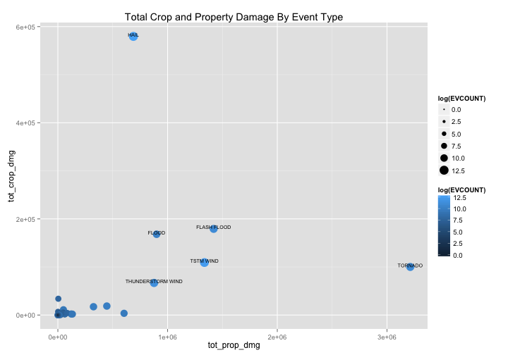

#The health and economic consequences of weather events in the United States

#Synopsis
This document and the accompanying analysis are based on an analysis of the U.S. National Oceanic and Atmospheric Administration's (NOAA) storm database. This database tracks characteristics of major storms and weather events in the United States, including when and where they occur, as well as estimates of any fatalities, injuries, and property damage. This analysis finds that, of all event types (according to NOAA classification), tornados and extreme heat events have the greatest impact on population health. In addition, the analysis finds that four event types--tornados, flood events, thunderstorms, and hail--have the greatest economic impact. This analysis has significant implications for both policy and weather researchers, as well as the fields of agriculture and health, and is a reminder of the tremendous impact weather still has on our lives and our economy.

#Data Processing
This section describes, using words and code, how the data were loaded into R and processed for analysis. In particular, your analysis must start from the raw CSV file containing the data. You cannot do any preprocessing outside the document. If preprocessing is time-consuming you may consider using the cache = TRUE option for certain code chunks.


```r
##To download data:
##url <- https://d396qusza40orc.cloudfront.net/repdata%2Fdata%2FStormData.csv.bz2
##download.file(url, destfile = "repdata-data-StormData.csv.bz2", method = "curl")
setwd("~/Documents/Coursera/Reproducible Research/Project 2")
stormdata <- read.csv(bzfile("repdata-data-StormData.csv.bz2"))

library(plyr)
library(dplyr)
```

```
## 
## Attaching package: 'dplyr'
## 
## The following objects are masked from 'package:plyr':
## 
##     arrange, count, desc, failwith, id, mutate, rename, summarise,
##     summarize
## 
## The following object is masked from 'package:stats':
## 
##     filter
## 
## The following objects are masked from 'package:base':
## 
##     intersect, setdiff, setequal, union
```

```r
event_total_fatalities <- ddply(stormdata, .(EVTYPE), summarize, total_fatalities = sum(FATALITIES))
event_total_fatalities <- arrange(event_total_fatalities, desc(total_fatalities))
event_mean_fatalities <- ddply(stormdata, .(EVTYPE), summarize, mean_fatalities = mean(FATALITIES, na.rm = TRUE))
event_mean_fatalities <- arrange(event_mean_fatalities, desc(mean_fatalities))
event_total_inj <- ddply(stormdata, .(EVTYPE), summarize, total_inj = sum(INJURIES))
event_total_inj <- arrange(event_total_inj, desc(total_inj))
event_mean_inj <- ddply(stormdata, .(EVTYPE), summarize, mean_inj = mean(INJURIES, na.rm = TRUE))
event_mean_inj <- arrange(event_mean_inj, desc(mean_inj))

##compile fatalities data and count data into single data frame

event_fatalities <- merge(event_total_fatalities, event_mean_fatalities)
event_count <- as.data.frame(table(stormdata$EVTYPE))
names(event_count) <- c("EVTYPE", "EVCOUNT")
event_fatalities <- merge(event_fatalities, event_count)
event_fatalities <- arrange(event_fatalities, desc(total_fatalities))

##data aggregation for injuries (assumes event_count already calculated)

event_inj <- merge(event_total_inj, event_mean_inj)
event_inj <- merge(event_inj, event_count)
event_inj <- arrange(event_inj, desc(total_inj))

##property damage calculations by event type
prop_dmg <- ddply(stormdata, .(EVTYPE), summarize, tot_prop_dmg = sum(PROPDMG))
crop_dmg <- ddply(stormdata, .(EVTYPE), summarize, tot_crop_dmg = sum(CROPDMG))

event_dmg <- merge(prop_dmg, crop_dmg)
event_dmg <- merge(event_dmg, event_count)
```

Notes on processed data:

* There are 30 different event types that have been linked at least 50 fatalities.
* Only 23 event types had an average fatality of greater than one per incident. 
* 14 event types have generated 1000 or more injuries. These are listed below:
* 11 event types have a mean injury incidence of more than 10 injuries per event.
* Total property damage for all recorded events was $10,884,500 and total crop damage was $1,377,827.

#Results

##Question 1: Across the United States, which types of events (as indicated in the EVTYPE variable) are most harmful with respect to population health?


Fatality and injury data is summarized in the plot below, which shows total fatalities and mean fatalities of various event types, with the number of occurrences of each event mapped to point size and color.


```r
library(ggplot2)
library(gridExtra)
```

```
## Loading required package: grid
```

```r
##fatalities plot using COUNT of events as size and color
p <- ggplot(event_fatalities, aes(x = total_fatalities, y = mean_fatalities, size = log(EVCOUNT), color = log(EVCOUNT)), ymax = 7000) + geom_point() + theme(legend.position="bottom")

##annotations
p <- p + ggtitle("Fatalities By Event Type") + annotate("text", x = 5633, y = 0.09, label = "TORNADO", size = 2.5, vjust = 0) + annotate("text", x = 1903, y = 1.13, label = "EXCESSIVE HEAT", size = 2.5, vjust = 0) + annotate("text", x = 978, y = 0.018, label = "FLASH FLOOD", size = 2.5, vjust = 1, hjust = 0) + annotate("text", x = 937, y = 1.22, label = "HEAT", size = 2.5, vjust = 0) + annotate("text", x = 816, y = 0.05, label = "LIGHTNING", size = 2.5, vjust = 0, hjust = 1) + annotate("text", x = 25, y = 25, label = "TORNADOES, TSTM WIND, HAIL", size = 2.5, vjust = 0, hjust = 0) + annotate("text", x = 14, y = 14, label = "COLD AND SNOW", size = 2.5, vjust = 0, hjust = 0) + annotate("text", x = 8, y = 8, label = "TROPICAL STORM GORDON", size = 2.5, vjust = 0, hjust = 0)


##injuries plot using COUNT of events as size and color

q <- ggplot(event_inj, aes(x = total_inj, y = mean_inj, size = log(EVCOUNT), color = log(EVCOUNT))) + geom_point() + theme(legend.position="bottom")
q <- q + ggtitle("Injuries By Event Type") + annotate("text", x = 91346, y = 1.5, label = "TORNADO", size = 2.5, vjust = 0) + annotate("text", x = 6525, y = 3.9, label = "EXCESSIVE HEAT", size = 2.5, vjust = 0, hjust = 0) + annotate("text", x = 70, y = 70, label = "HEAT WAVE", size = 2.5, vjust = 0, hjust = 0) + annotate("text", x = 43, y = 43, label = "TROPICAL STORM GORDON", size = 2.5, vjust = 0, hjust = 0) + annotate("text", x = 150, y = 37.5, label = "WILD FIRES", size = 2.5, vjust = 0, hjust = 0) + annotate("text", x = 27, y = 27, label = "THUNDERSTORMW", size = 2.5, vjust = 0, hjust = 0)

grid.arrange(p, q, ncol = 2)
```


* Fatalities: While the three points with very large mean fatalities--"TORNADOES, TSTM WIND, HAIL", "COLD AND SNOW", and "TROPICAL STORM GORDON"--appear to be extremely dangerous events, each only occurs once in the dataset--meaning that while these isolated occurrences were unusually dangerous, such events are extremely unlikely to recur. Tornado, excessive heat, flash flood, heat, and lightning, by contrast, are relatively frequent occurrences--lightning occurs 816 times in the data, and tornados occur 5633 times. These events, therefore, ought to be considered much more harmful to population health. It is worth noting that, besides these isolated incidents, every other incident occurring more than 5 times in the dataset (i.e., 5 times over the course of 50+ years) has a mean fatality rate of less than 5 per incidence.
* Injuries: Again, looking at the count of each event type allows us to disregard almost all of the events with the highest mean injury rates. All 4 of the event types along the y-axis in the injuries plot occur only once, with the exception of wildfires, which only occurs 4 times and has caused a total of only 150 injuries overall. Again, we should note  that, besides these isolated incidents, every other incident occurring more than 5 times in the dataset (i.e., 5 times over the course of 50+ years) has a mean injury rate of less than 10 per incidence.
* Overall analysis: This analysis leads me to conclude that the events that are the most harmful with respect to population health, according to the data provided, are TORNADOS. Tornados occur frequently, and have been responsible for the most fatalities and injuries of any event type in the dataset, by far. Extreme heat events--"heat", "excessive heat", and "heat wave"--appear to be the second most harmful, causing both significant amounts of fatalities and injuries.


##Question 2: Across the United States, which types of events have the greatest economic consequences?

The figure below summarizes proprty damage (x-axis) and crop damage (y-axis), with the number of occurrences of each event mapped to point size and color. Note that a point's distance from the origin relates its total overall cost (property + crop damage).


```r
s <- ggplot(event_dmg, aes(x = tot_prop_dmg, y = tot_crop_dmg, size = log(EVCOUNT), color = log(EVCOUNT))) + geom_point() + theme(legend.position="right")

s <- s + ggtitle("Total Crop and Property Damage By Event Type") + annotate("text", x = 3212258.2, y = 100018.5, label = "TORNADO", size = 2.5, vjust = 0) + annotate("text", x = 1420124.6, y = 179200.46, label = "FLASH FLOOD", size = 2.5, vjust = 0) + annotate("text", x = 1335965.6, y = 109202.60, label = "TSTM WIND", size = 2.5, vjust = 0) + annotate("text", x = 899938.5, y = 168037.88, label = "FLOOD", size = 2.5, vjust = 0) + annotate("text", x = 876844.2, y = 66791.45, label = "THUNDERSTORM WIND", size = 2.5, vjust = 0) + annotate("text", x = 688693.4, y = 579596.28, label = "HAIL", size = 2.5, vjust = 0)

s
```



This analysis highlights four types of events as the most economically significant:

1. Tornados: Tornado events occur frequently and cause significant property damage (over $3,200,000 in this dataset alone), far more than any other individual event category. These are to be considered the event with the greatest economic consequences.
2. Flood events: Taken together, flash floods and floods account for just under $3,000,000 in property damage--nearly as much as tornados. Even though these are considered separate types of weather events, both have similar causes and likely also take similar measures for prevention, so taking steps to address damage from flooding is likely to be nearly as impactful as tornado damage prevention efforts (especially when considering that flooding causes nearly triple the crop damage as tornados).
3. Thunderstorms: Similar to the flood categories, taken together, thunderstorms also account for a significant amount of damage combined, and also occur frequently. Of special note for thunderstorms is that these are the highest-frequency events in the dataset, with 219940 occurrences of TSTM wind.
4. Hail: While hail does not cause as much property damage as the other event types, it causes significant crop damage--far more than any other event type. For this reason alone, hail should also be considered a highly economically-significant weather event.

